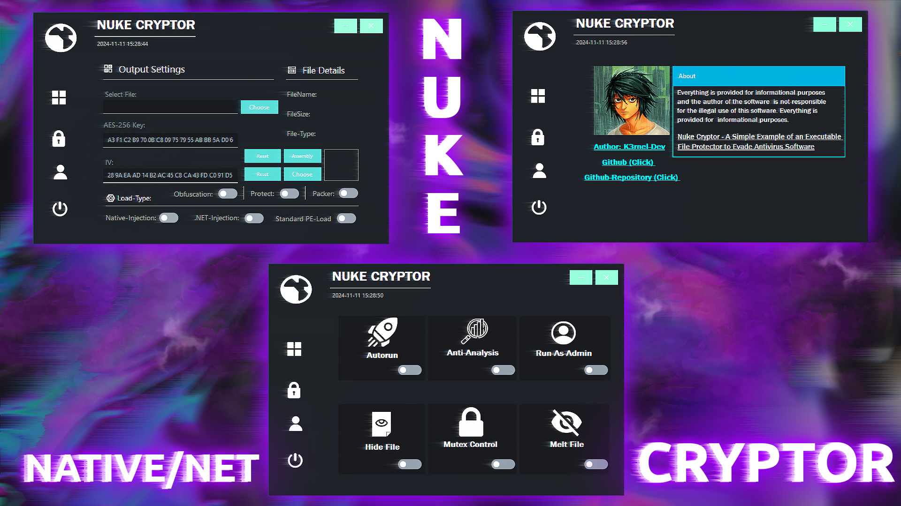
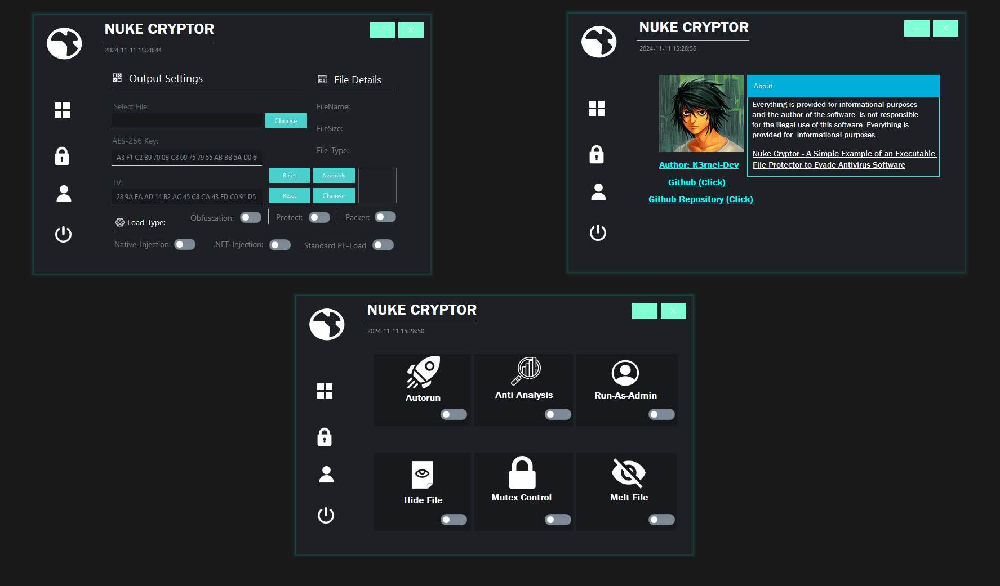
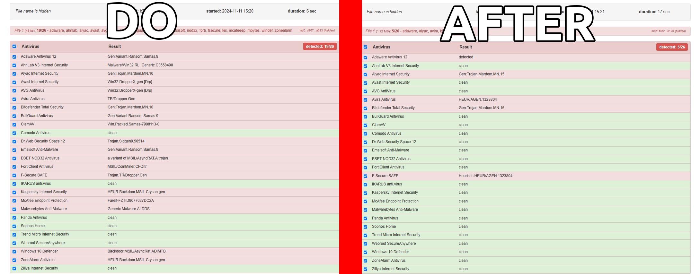

# ⚔️ NUKE CRYPTOR (.NET/NATIVE)




---

### > **[⬇️ Download for Windows](https://github.com/K3rnel-Dev/NukeCryptor/releases/tag/Build)**

---

# 🛡️ About
>**NUKE Cryptor** is an example cryptor designed for the protection of executable files from antivirus detection. This project is purely experimental and created for educational purposes. It demonstrates a wide array of protection methods including encryption, obfuscation, and anti-analysis features, making it an effective learning tool for malware analysis and security research.

The cryptor includes a built-in packer, providing additional protection against static signature detection by hiding file attributes and patching AMSI (Antimalware Scan Interface) to evade Windows Defender. Other notable features include:

- 🔥 **Self-Removal (Melting)**: Removes itself from the disk after execution.
- 🕵️‍♂️ **Anti-Analysis Techniques**: Includes detection of virtual machines, debuggers, and anti-analysis techniques to hinder reverse engineering.
- 👻 **HideFile**: Changes the file's attributes to hidden.
- 🚀 **Autorun**: Adds a file to startup.
- 🛠️ **Mutex Control**: Prevents re-execute on the system.
- 🔑 **Run As Administrator**: Executing with elevated permissions.
- ⚙️ **Conditional Compilation**: Allows the cryptor to include only the features and options chosen by the user, making the final build more streamlined.
- 🔒 **Custom Renaming and Obfuscation**: Includes customizable renaming of functions and string encryption to make the code less readable and harder to analyze.
- 🛡️ **Advanced Protection Layer**: Adds extra layers of code obfuscation, call hiding, and mutation techniques on top of the base protector using .NET Reactor.

# 🚀 Injection Methods
Cryptor supports 3-nd injection methods:

1. **Self-Injection (Standard PE-Load)**: Injects the payload into the stub own process.
2. **Native Process Injection**: Randomly selects a native system process for injection.
3. **.NET Process Injection**: Injecting into other random .NET process.

# 🔒 Cryptographic Layers
Cryptor uses a layered approach to protection:
- **AES-256 Decryption**: The primary loader module decrypts the payload using AES-256, ensuring a decryption process in memory for the main executable.
- **XOR Encryption**: The packer includes an additional layer of XOR-based encryption, which, if enabled by the user, performs decryption in primary module, adding a third layer of security.

# 📒 How to Use
> The first select your file that you want to protect, then select the necessary options (I recommend the combination Obfuscation + Protect + Packer with Standart-PE-Load) then to compile the final file, click on the last button on the left side of the program bar and the compilation process will begin.
> 
# 🖥️ Showcase & Detection
>
>


## ⚠️ **Disclaimer**: 
```
This project is for educational purposes only, intended for studying malware and security techniques. The author is not responsible for any malicious use of this software.
```
<br>

# ⭐ Credits 

- **Author**: <a href="https://github.com/k3rnel-dev">@K3rnel-Dev</a>
- **dnlib**: A library for manipulating .NET assemblies.  
  GitHub: [https://github.com/0xd4d/dnlib](https://github.com/0xd4d/dnlib)
- **Eziriz**: .NET Extended protector.  
  Web: [https://www.eziriz.com/dotnet_reactor.htm](https://www.eziriz.com/dotnet_reactor.htm)

---
